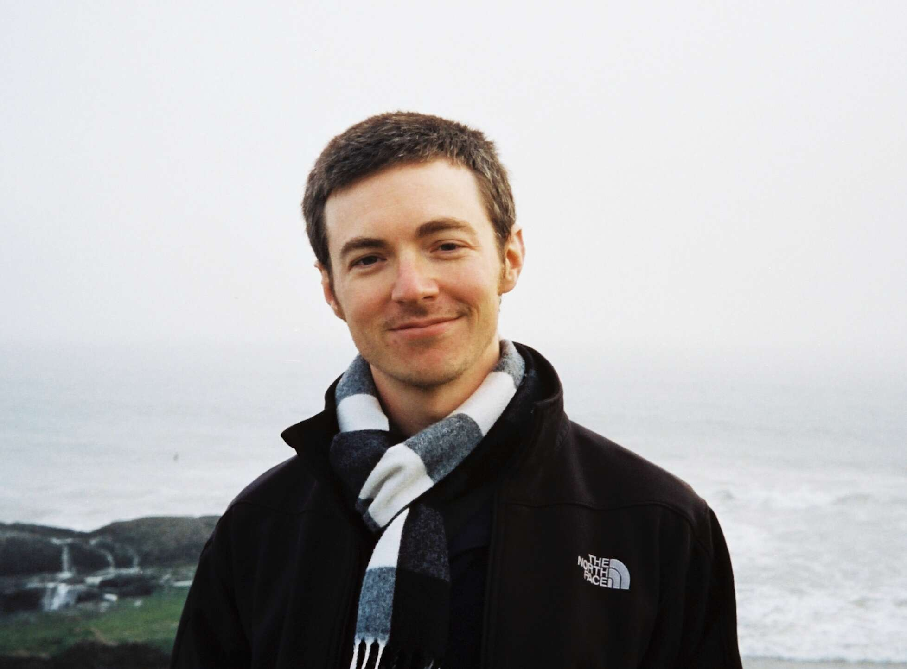

<meta charset="utf-8">
<meta name="viewport" content="width=device-width, initial-scale=1.0, maximum-scale=10, user-scalable=yes">
<title>Zachary D. Sisco</title>

<header>
  <h1>Zachary D. Sisco</h1>
  

  

  

</header>

I am an [Assistant Professor](https://sds.cuhk.edu.cn/en/teacher/2233) of Computer Science in the [School of Data Science](https://sds.cuhk.edu.cn/en) at the [Chinese University of Hong Kong, Shenzhen](https://cuhk.edu.cn/en).
I completed my PhD at UC Santa Barbara, co-advised by [Jonathan Balkind](https://jbalkind.github.io/) and [Ben Hardekopf](https://sites.cs.ucsb.edu/~benh/).

I conduct research at the intersection of __Programming Languages__ and __Computer Architecture__.
My research integrates formal methods into open-source languages for chip design to increase developer agility with correctness guarantees.

I am looking for students!
You can read my [research overview](research.html) for more information.
If you think we have mutual interests, please send me an email: SPAM `zsisco【at】` <!-- qazwsxedcrfvtgbthnplmokjnibiuh --> `cuhk「dot」edu《dot》cn`

### Conference and Journal Publications

* [Control Logic Synthesis: Drawing the Rest of the OWL](papers/control-logic-synthesis.pdf) (ASPLOS 2024)  
  __Zachary D. Sisco__, Andrew David Alex, Zechen Ma, Yeganeh Aghamohammadi,
  Boming Kong, Benjamin Darnell, Timothy Sherwood, Ben Hardekopf, Jonathan Balkind  
  [(Source code repo)](https://github.com/UCSBarchlab/owl)
* [Loop Rerolling for Hardware Decompilation](papers/loop-rerolling-hw-decompilation.pdf) (PLDI 2023)  
  __Zachary D. Sisco__, Jonathan Balkind, Timothy Sherwood, Ben Hardekopf  
  [(Source code repo)](https://git.sr.ht/~zachs/hardware-loop-rerolling)
* [A semantics-based approach to concept assignment in assembly code](papers/semantics-based-approach-to-concept-assignment-in-assembly-code.pdf) (ICCWS 2017)  
  __Zachary D. Sisco__, Adam Bryant
* [Modeling information flow for an autonomous agent to support reverse engineering work](papers/modeling-information-flow_preprint_version-2.pdf) (JDMS 2017)  
  __Zachary D. Sisco__, Patrick Dudenhofer, Adam Bryant

### Workshop Papers

* [There and Back Again: A Netlist's Tale With Much Egraphin'](papers/there-and-back-again.pdf) (LATTE 2024)  
  Gus Henry Smith, __Zachary D. Sisco__, Thanawat Techaumnuaiwit, Jingtao Xia,
  Vishal Canumalla, Andrew Cheung, Zachary Tatlock, Chandrakana Nandi, Jonathan Balkind  
  [(Web demo)](https://sampl.cs.washington.edu/churchroad-web-demo/)
* [Semi-Automated Translation of a Formal ISA Specification to Hardware](papers/plarch23.pdf) (PLARCH 2023)  
  Harlan Kringen, __Zachary Sisco__, Jonathan Balkind, Timothy Sherwood, Ben Hardekopf
* On the Generality of Matrix Multiplication (PLARCH 2023)  
  Andrew Alex, __Zachary D. Sisco__, Jonathan Balkind
* [A Position on Program Synthesis for Processor Development](papers/a-position-on-program-synthesis-for-processor-development.pdf) (LATTE 2022)  
  __Zachary D. Sisco__, Jonathan Balkind, Timothy Sherwood, Ben Hardekopf  
  [(Source code repo)](https://github.com/pllab/latte22-demo)

<!-- ### Recorded Talks -->

<!-- * [Latch-Up 2025]() -->
<!-- * [PLDI 2023]() -->
<!-- * [LATTE 2022]() -->

### Theses

* [Automated Reasoning for Agile and Robust Chip Design](papers/sisco-dissertation.pdf)  
  PhD Dissertation (UC Santa Barbara) 2025
* [Verifying data-oriented gadgets in binary programs to build data-only exploits](papers/sisco-zachary-thesis.pdf)  
  MS Thesis (Wright State University) 2018

### Bits

* [Formalizing a Consensus Protocol using Dependent Session Types](papers/dusty.pdf)
* [Scheme2Beam: A Source Compiler from Scheme to Erlang](papers/Scheme2Beam.pdf)
* [Investigations into a Separating-typed Language](papers/Separating_typed_Languages.pdf)
* [Synthesizing Concurrent Code using a Solver-aided DSL](papers/conimp.pdf)

## Photography

* [Photo albums:](https://photos.zsisco.net)  
  I've recently gotten into film photography.
  I shoot on an old [Olympus Trip 35](http://camera-wiki.org/wiki/Olympus_Trip_35) ---
  mine was manufactured in Japan around October, 1973.

<footer>This page is <a href="http://jeffhuang.com/designed_to_last/">designed to last</a>.</footer>
