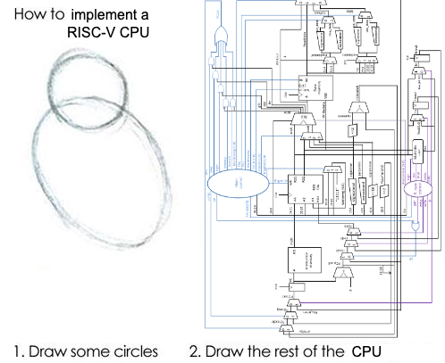

<meta charset="utf-8">
<meta name="viewport" content="width=device-width, initial-scale=1.0, maximum-scale=10, user-scalable=yes">
<title>Zachary D. Sisco</title>

<header id="top">
  <h1>Zachary D. Sisco</h1>
  

  

  

</header>

I am an [Assistant Professor](https://sds.cuhk.edu.cn/en/teacher/2233) of Computer Science in the [School of Data Science](https://sds.cuhk.edu.cn/en) at the [Chinese University of Hong Kong, Shenzhen](https://cuhk.edu.cn/en).
I completed my PhD at UC Santa Barbara, co-advised by [Jonathan Balkind](https://jbalkind.github.io/) and [Ben Hardekopf](https://sites.cs.ucsb.edu/~benh/).

I conduct research at the intersection of __Programming Languages__ and __Computer Architecture__.
My research integrates formal methods into open-source languages for chip design to increase developer agility with correctness guarantees.

I am looking for students!
You can read my [research overview](#research-overview) for more information.
If you think we have mutual interests, please send me an email: SPAM `zsisco【at】` <!-- qazwsxedcrfvtgbthnplmokjnibiuh --> `cuhk「dot」edu《dot》cn`

### Conference and Journal Publications

* [Control Logic Synthesis: Drawing the Rest of the OWL](papers/control-logic-synthesis.pdf) (ASPLOS 2024)  
  __Zachary D. Sisco__, Andrew David Alex, Zechen Ma, Yeganeh Aghamohammadi,
  Boming Kong, Benjamin Darnell, Timothy Sherwood, Ben Hardekopf, Jonathan Balkind  
  [(Source code repo)](https://github.com/UCSBarchlab/owl)
* [Loop Rerolling for Hardware Decompilation](papers/loop-rerolling-hw-decompilation.pdf) (PLDI 2023)  
  __Zachary D. Sisco__, Jonathan Balkind, Timothy Sherwood, Ben Hardekopf  
  [(Source code repo)](https://git.sr.ht/~zachs/hardware-loop-rerolling)
* [A semantics-based approach to concept assignment in assembly code](papers/semantics-based-approach-to-concept-assignment-in-assembly-code.pdf) (ICCWS 2017)  
  __Zachary D. Sisco__, Adam Bryant
* [Modeling information flow for an autonomous agent to support reverse engineering work](papers/modeling-information-flow_preprint_version-2.pdf) (JDMS 2017)  
  __Zachary D. Sisco__, Patrick Dudenhofer, Adam Bryant

### Workshop Papers

* [There and Back Again: A Netlist's Tale With Much Egraphin'](papers/there-and-back-again.pdf) (LATTE 2024)  
  Gus Henry Smith, __Zachary D. Sisco__, Thanawat Techaumnuaiwit, Jingtao Xia,
  Vishal Canumalla, Andrew Cheung, Zachary Tatlock, Chandrakana Nandi, Jonathan Balkind  
  [(Web demo)](https://sampl.cs.washington.edu/churchroad-web-demo/)
* [Semi-Automated Translation of a Formal ISA Specification to Hardware](papers/plarch23.pdf) (PLARCH 2023)  
  Harlan Kringen, __Zachary Sisco__, Jonathan Balkind, Timothy Sherwood, Ben Hardekopf
* On the Generality of Matrix Multiplication (PLARCH 2023)  
  Andrew Alex, __Zachary D. Sisco__, Jonathan Balkind
* [A Position on Program Synthesis for Processor Development](papers/a-position-on-program-synthesis-for-processor-development.pdf) (LATTE 2022)  
  __Zachary D. Sisco__, Jonathan Balkind, Timothy Sherwood, Ben Hardekopf  
  [(Source code repo)](https://github.com/pllab/latte22-demo)

### Recorded Talks

* [A Memory Design Language for Automated Memory Technology Mapping](https://youtu.be/S1IA-8DxDIs) (May 2025)  
  Latch-Up, Santa Barbara, CA. 
* [Loop Rerolling for Hardware Decompilation](https://www.youtube.com/watch?v=LG0rHhfohFo) (June 2023)  
  PLDI/FCRC 2023, Orlando, FL.
* [A Position on Program Synthesis for Processor Development](https://youtu.be/FWPh26MOybg) (March 2022)  
  LATTE 2022 @ ASPLOS 2022, Lausanne, Switzerland / Virtual.

### Theses

* [Automated Reasoning for Agile and Robust Chip Design](papers/sisco-dissertation.pdf)  
  PhD Dissertation (UC Santa Barbara) 2025
* [Verifying data-oriented gadgets in binary programs to build data-only exploits](papers/sisco-zachary-thesis.pdf)  
  MS Thesis (Wright State University) 2018

### Random Bits

* [Formalizing a Consensus Protocol using Dependent Session Types](papers/dusty.pdf)
* [Scheme2Beam: A Source Compiler from Scheme to Erlang](papers/Scheme2Beam.pdf)
* [Investigations into a Separating-typed Language](papers/Separating_typed_Languages.pdf)
* [Synthesizing Concurrent Code using a Solver-aided DSL](papers/conimp.pdf)

# Research Overview

The programming languages and tools used for chip design have not kept pace with the growing complexity of these chips for emerging applications.
To handle these demands, and to enable newcomers to the space with smaller teams and fewer resources, we need new approaches to address the current state-of-the-art in chip development.

The research I conduct addresses 3 key challenges in chip design:

1. __Multilevel reasoning__: The current chip development process suffers from decoupling between all of the layers of abstraction.
Enormous effort goes into verification between the specifications, models, and implementation—the difficulty being the semantic gap between these layers.
This disjointed process leads to long design iterations, hindering agility and increasing verification burden.

2. __Interoperability__: The growth of new HDLs and open-source hardware design tools adds new features that improve the process of designing hardware over legacy languages and proprietary tools.
However, these new languages and tools often lack the ability the interoperate, fragmenting the communities that use them and making migration difficult, as manual porting is impractical.
Limited interoperability means that new HDLs cannot leverage the vast body of existing designs written in legacy languages, and existing designs cannot take advantage of the new features provided by these modern tools.

3. __Technology constraints__: Languages and tools for chip design rely on technology-specific components, but lack helpful abstractions needed to support common deployment platforms, making it difficult to adapt and compose designs.
Targeting platforms, such as ASIC and FPGA, requires technology-specific code and so each new technology being targeted requires updating an existing part of the code with multiple independent descriptions of the same component.

To address these challenges, my research integrates __automated-reasoning techniques__, such as constraint solvers and equational reasoning, into programming languages used for chip design.
These techniques improve developer agility and provide formal guarantees about the design.
For example:

1. Integrating constraint solvers (SMT) into languages for chip design to enable program synthesis and correct-by-construction code generation.
2. Using equational reasoning to transform designs into equivalent but optimal representations.
3. Developing domain-specific languages (DSLs) which incorporate domain models into languages for design tasks.

## Projects

These projects tackle different aspects of the challenges outlined above using automated-reasoning techniques.

### Control Logic Synthesis

Chip design requires reasoning between different layers of abstraction: from an architectural specification (the instructions the chip executes), to the microarchitectural datapath (the functional units), down to the low-level control logic (which coordinates computation on the chip).
Implementing control logic itself is tedious and error-prone, where changes at these levels propagate non-obvious changes to the control.
This work, published in [ASPLOS 2024](https://dl.acm.org/doi/10.1145/3622781.3674170), introduces a new technique, __control logic synthesis__, which automatically generates conrrect-by-construction control logic for a datapath according to a formal architectural specification.

The insight is adapting program synthesis techniques to HDLs, bridging the gap between the datapath and the high-level specification---a key direction we previously identified [(LATTE 2022)](papers/a-position-on-program-synthesis-for-processor-development.pdf).
Control logic synthesis allows chip developers to freely modify and iterate over the designs of both the specification and the datapath without getting caught up in the abstruse details of control, as we show in case studies covering embedded-class RISC-V cores and accelerators geared for cryptographic applications.

Future work will consider more control structures such as microcode in the context of complex microarchitecture optimizations.
There are challenges ahead in terms of scaling automated reasoning techniques to handle large, real-world chip implementations.

### Hardware Decompilation

Imagine I handed you this chip.
How could you know what's inside it?
To date, hobbyists interested in this kind of computer archaeology take photos of chips and apply machine learning to identify individual components.
But from there a new problem arises: how do you know what that sea of components actually _means_?
For instance, what if you wanted to duplicate this chip?
Or what if you wanted to recover the code that produced the chip in the first place?
This is the problem we call __hardware decompilation__:
Taking a digital circuit like in this photo and recovering the high-level source code that can reproduce it.

By the way, this photo is of the Z80, an 8-bit microprocessor made around 1975.
Chips nowadays could be made up of tens of _billions_ of components.
Modern digital design is complex, and chip designers have to analyze these enormous circuits, which is often a bottle neck in the design process.
This research not only helps hobbyists reverse engineer vintage computers, hardware decompilation enables new design tools for modern chip designers.
Recovering structure in digital circuits allows chip designers to analyze circuits faster and with stronger correctness guarantees.

Our initial work in hardware decompilation focused on [hardware loop rerolling](https://dl.acm.org/doi/10.1145/3591237A), which is about finding repeated logic in circuits and lifting it to loops in high-level HDL code.
There are many more programming abstractions to recover such as modules, state machines, memory, etc., as well as applications for hardware decompilation to improve the design process (such as automated technology re-targeting).

### Refinement via Formal Specifications

An open question for specification-driven chip development is: how to refine an implementation from a spec?
We are exploring methods for deriving whole chip implementations from architectural specifications [(PLARCH 2023)](papers/plarch23.pdf).
The long-term goal is to develop techniques that fully _derive_ HDL code implementations for entire chips from formal architectural specifications, where compilation proceeds as a series of proof-carrying _refinements_ moving down the layers of abstraction from the architecture-level to the microarchitecture, all the way to hardware.

### Enriching Hardware--Software Interfaces

Besides general-purpose computing, there are other aspects of the hardware--software interface such as communication and data-movement protocols and hardware accelerators that speed up specialized computation and system services.
The difficulty in using these interfaces lies in the development process; current languages and libraries do not provide the machinery to guide programmers to correctly use them.
Further, these interfaces run through the whole hardware--software stack, encountering constraints through each layer.
Characterizing these interfaces as abstractions found in programming language theory, we are developing new compilers that bridge the hardware--software interface at these new frontiers to ensure correctness of the use of---and even the automated synthesis of code using---these interfaces through symbolic reasoning and constraint solvers.
Our previous work in control logic synthesis paves the way for exploring these new interfaces, assisting the programmer in reasoning about specialized hardware where they may have limited understanding.

## Tips for Prospective Students

All of this research intersects with three areas: programming languages, computer architecture, and formal methods.
It is not required or expected that you have familiarity with all of these areas.
But you should have an interest in at least one, and an openness to the others.

[Back to top ↑](#top)

<footer>This page is <a href="http://jeffhuang.com/designed_to_last/">designed to last</a>.</footer>
